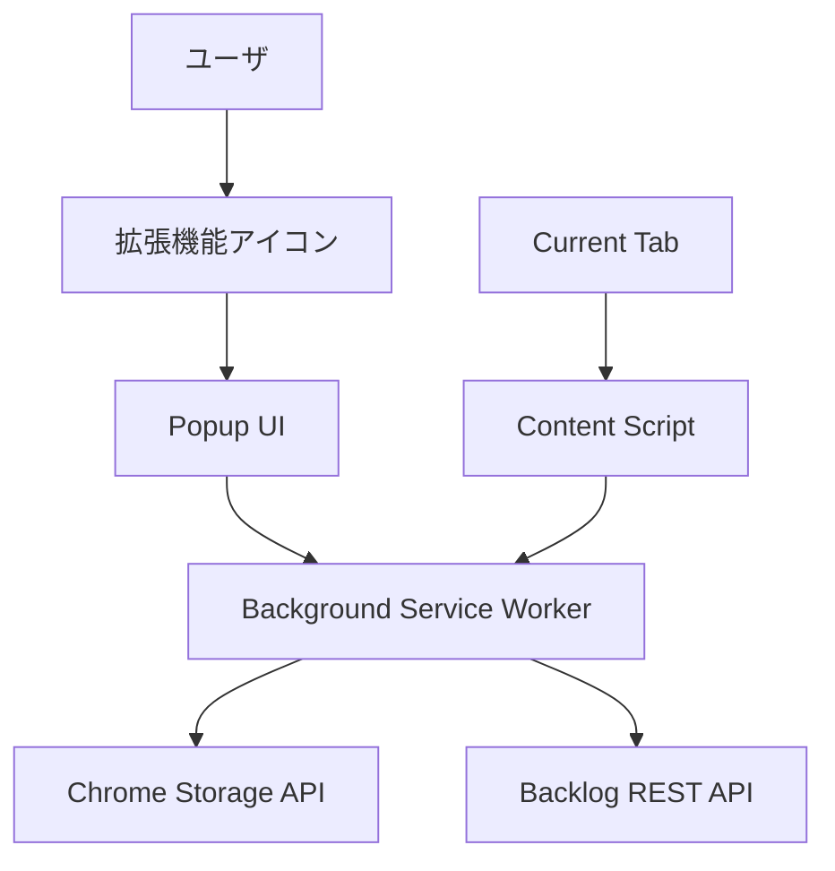

# 設計書

## 概要

Chrome拡張機能（Manifest V3）として実装するBacklog課題作成ツール。Service Workerベースのアーキテクチャを採用し、ポップアップUIとContent Scriptを組み合わせて、ユーザがブラウザを離れることなくBacklogに課題を追加できるシステムを構築する。

## アーキテクチャ

### システム構成



### コンポーネント構成

1. **Manifest.json** - 拡張機能の設定とpermissions定義
2. **Background Service Worker** - APIキー管理、Backlog API通信、データ永続化
3. **Popup UI** - メインインターフェース（Settings、Add Issue）
4. **Content Script** - 現在のタブのURL取得
5. **Chrome Storage API** - APIキーとユーザデータの永続化

### プロジェクトファイル構成

```
anybacklog/
├── manifest.json                 # 拡張機能マニフェスト
├── background/
│   └── service-worker.js        # バックグラウンド処理
├── content/
│   └── url-extractor.js         # URL取得スクリプト
├── popup/
│   ├── popup.html              # ポップアップUI
│   ├── popup.js                # ポップアップロジック
│   └── popup.css               # スタイルシート
├── assets/
│   ├── icon16.png              # 16x16アイコン
│   ├── icon48.png              # 48x48アイコン
│   └── icon128.png             # 128x128アイコン
├── .gitignore                   # Git除外設定
├── README.md                    # プロジェクト説明書
└── package.json                 # 依存関係管理（開発用）
```

## コンポーネントと インターフェース

### 1. Manifest設定

```javascript
{
  "manifest_version": 3,
  "name": "AnyBacklog",
  "version": "1.0.0",
  "permissions": [
    "storage",
    "activeTab",
    "https://*.backlog.jp/*",
    "https://*.backlog.com/*"
  ],
  "background": {
    "service_worker": "background/service-worker.js"
  },
  "content_scripts": [{
    "matches": ["<all_urls>"],
    "js": ["content/url-extractor.js"]
  }],
  "action": {
    "default_popup": "popup/popup.html"
  }
}
```

### 2. Background Service Worker

**主要機能:**
- APIキーの暗号化保存・復元
- Backlog API通信の管理
- プロジェクト一覧の取得とキャッシュ
- 課題作成処理

**インターフェース:**
```javascript
// APIキー管理
saveApiKey(apiKey: string): Promise<boolean>
getApiKey(): Promise<string | null>
deleteApiKey(): Promise<boolean>

// Backlog API通信
getProjects(): Promise<Project[]>
createIssue(projectId: string, summary: string, description: string): Promise<Issue>

// ユーザ情報取得
getCurrentUser(): Promise<User>
```

### 3. Popup UI

**Settings Panel:**
- APIキー入力フィールド
- 登録/変更/削除ボタン
- 状態表示（登録済み/未登録）

**Add Issue Panel:**
- プロジェクト選択プルダウン（検索機能付き）
- 件名入力フィールド（255文字制限、長文対応）
  - 実装方式: `<textarea>` を使用し、自動高さ調整を実装
  - 最小高さ: 1行分（約36px）
  - 最大高さ: 3行分（約108px）
  - 3行を超える場合は垂直スクロール表示
  - 入力に応じて動的に高さを調整
- 説明プレビュー（URL自動埋め込み）
- 作成ボタン

**インターフェース:**
```javascript
// UI状態管理
showSettingsPanel(): void
showAddIssuePanel(): void
updateProjectList(projects: Project[]): void
showMessage(message: string, type: 'success' | 'error'): void

// フォーム処理
validateSummary(summary: string): boolean
filterProjects(query: string): Project[]
```

### 4. Content Script

**機能:**
- 現在のタブのURL取得
- ページタイトル取得（課題説明の補完用）

**インターフェース:**
```javascript
getCurrentPageInfo(): Promise<{url: string, title: string}>
```

## データモデル

### APIキー

```javascript
interface ApiKeyData {
  encryptedKey: string;
  domain: string; // backlog.jp or backlog.com
  createdAt: Date;
}
```

### プロジェクト

```javascript
interface Project {
  id: string;
  key: string;
  name: string;
  description?: string;
}
```

### 課題

```javascript
interface IssueCreateRequest {
  projectId: string;
  summary: string;
  description: string;
  assigneeId: string;
  dueDate: string; // YYYY-MM-DD format
}
```

### ユーザ

```javascript
interface User {
  id: string;
  name: string;
  mailAddress: string;
}
```

## 正確性プロパティ

*プロパティとは、システムのすべての有効な実行において真であるべき特性や動作のことです。これらは人間が読める仕様と機械で検証可能な正確性保証の橋渡しとなります。*

前作業分析に基づいて、以下の正確性プロパティを定義します：

### プロパティ1: APIキー操作の正確性
*任意の* 有効なAPIキーに対して、保存→取得→変更→削除の操作を行った場合、各操作が正しく実行され、期待される状態変化が発生する
**検証: 要件 2.3, 2.5, 2.6**

### プロパティ2: プロジェクト検索の正確性
*任意の* 検索文字列に対して、プロジェクト絞り込み検索を実行した場合、返される結果はすべて検索文字列を含むプロジェクトのみである
**検証: 要件 3.4**

### プロパティ3: プロジェクト選択の永続性
*任意の* プロジェクトを選択した場合、そのプロジェクトが正しく記録され、後続の操作で参照可能である
**検証: 要件 3.5**

### プロパティ4: 件名文字数制限の適用
*任意の* 入力文字列に対して、件名入力フィールドは255文字以内の制限を正しく適用し、超過した場合は適切に制限する
**検証: 要件 4.2**

### プロパティ5: 件名入力フィールドの視認性
*任意の* 長さの入力テキストに対して、件名入力フィールドは入力テキスト全体を視認可能にする（複数行表示または自動スクロール）
**検証: 要件 4.4, 4.5**

### プロパティ6: 課題作成時の自動設定
*任意の* 課題作成操作において、担当者がAPIキー登録ユーザに設定され、期限日が登録日当日に設定される
**検証: 要件 4.8, 4.9**

### プロパティ7: APIキー保存の正確性
*任意の* APIキーを保存する際、Chrome拡張機能のストレージAPIを使用し、データが暗号化されて保存される
**検証: 要件 5.1, 5.2**

### プロパティ8: APIキー永続化のラウンドトリップ
*任意の* APIキーを保存した後、ブラウザ再起動を経ても、保存されたAPIキーが正しく復元される
**検証: 要件 5.3**

### プロパティ9: データ削除の完全性
*任意の* APIキー削除操作において、APIキーとそれに関連するすべてのデータが完全に削除される
**検証: 要件 5.4**

### プロパティ10: 必須フィールド検証の網羅性
*任意の* 必須フィールドが未入力の状態で操作を実行した場合、適切な入力エラーメッセージが表示される
**検証: 要件 6.3**

### プロパティ11: エラー後の状態維持
*任意の* エラーが発生した場合でも、システムは一貫した状態を維持し、ユーザが操作を継続できる
**検証: 要件 6.5**

## エラーハンドリング

### エラー分類と対応

1. **ネットワークエラー**
   - Backlog API接続失敗
   - タイムアウト
   - 対応: リトライ機能、ユーザへの明確なエラーメッセージ

2. **認証エラー**
   - 無効なAPIキー
   - 権限不足
   - 対応: APIキー再設定の促し、権限確認メッセージ

3. **入力検証エラー**
   - 必須フィールド未入力
   - 文字数制限超過
   - 対応: リアルタイム検証、明確な制限表示

4. **システムエラー**
   - ストレージアクセス失敗
   - 予期しない例外
   - 対応: ログ記録、安全な状態への復旧

### エラー回復戦略

- **グレースフルデグラデーション**: 一部機能が利用できない場合でも、利用可能な機能は継続提供
- **状態の一貫性**: エラー発生時も、ユーザデータの整合性を維持
- **ユーザガイダンス**: エラー原因と解決方法を明確に提示

## テスト戦略

### 二重テストアプローチ

**ユニットテスト**:
- 特定の例、エッジケース、エラー条件の検証
- UI操作の個別機能テスト
- API通信のモック化テスト

**プロパティベーステスト**:
- 全入力に対する普遍的プロパティの検証
- 最小100回の反復実行
- ランダム化による包括的入力カバレッジ

### プロパティベーステスト設定

- **テストライブラリ**: fast-check（JavaScript用プロパティベーステストライブラリ）
- **実行回数**: 各プロパティテストで最小100回の反復
- **タグ形式**: **Feature: anybacklog, Property {番号}: {プロパティテキスト}**

### テストカバレッジ

- **ユニットテスト**: 具体的な動作例、統合ポイント、エッジケース、エラー条件
- **プロパティテスト**: ランダム化による全入力での普遍的プロパティ検証
- **統合テスト**: Chrome拡張機能環境での実際の動作確認

両方のテストアプローチが相互補完的に機能し、包括的なカバレッジを提供します。

## プロジェクト配布とセットアップ

### 必要なプロジェクトファイル

**README.md**:
- プロジェクト概要と機能説明
- インストール手順（開発者モード）
- 使用方法とAPIキー設定手順
- 他の開発者への配布コマンド
- トラブルシューティング

**package.json**:
- 開発依存関係の管理
- テスト実行スクリプト
- ビルドスクリプト（必要に応じて）

**.gitignore**:
```
# 開発環境
node_modules/
.env
.env.local

# ビルド成果物
dist/
build/

# IDE設定
.vscode/
.idea/

# OS生成ファイル
.DS_Store
Thumbs.db

# ログファイル
*.log

# テスト結果
coverage/
test-results/
```

### 配布方法

1. **開発者向け配布**:
   - GitHubリポジトリでのソースコード共有
   - `git clone` → `npm install` → Chrome拡張機能として読み込み

2. **エンドユーザー向け配布**:
   - Chrome Web Storeでの公開（将来的）
   - .crxファイルでの直接配布

3. **配布コマンド例**:
```bash
# 開発環境セットアップ
git clone <repository-url>
cd anybacklog
npm install

# テスト実行
npm test

# Chrome拡張機能として読み込み
# Chrome → 拡張機能 → デベロッパーモード → パッケージ化されていない拡張機能を読み込む
```
